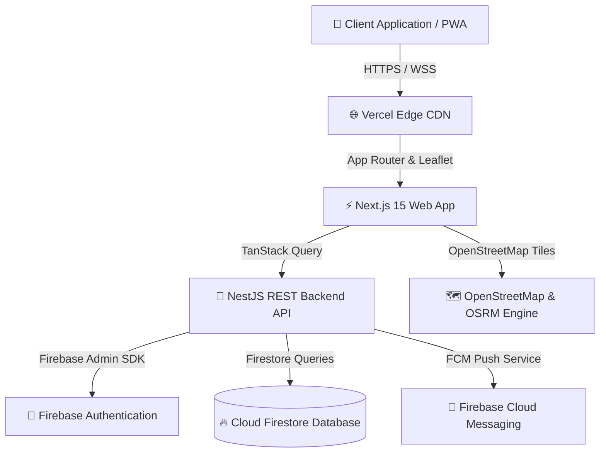

<div align="center">

# 🏥 MedStart
### Enterprise Hospital Finder & Turn-by-Turn GPS Navigation Platform

[](https://nextjs.org/)
[](https://react.dev/)
[](https://www.typescriptlang.org/)
[](https://tailwindcss.com/)
[](https://firebase.google.com/)
[](https://nestjs.com/)
[](https://www.w3.org/TR/WCAG22/)
[](https://opensource.org/licenses/MIT)

**MedStart** is an enterprise-grade, high-availability healthcare directory and turn-by-turn navigation system designed to connect emergency patients with verified medical centers, real-time ICU bed availability, and specialty doctors in under 3 taps.

[Explore Documentation](docs/README.md) · [View API Specs](#-rest-api-documentation) · [Report Bug](https://github.com/bunnyvalluri/Med-Start/issues)

---

</div>

## 🌟 Key Platform Features

- 📍 **Instant GPS Proximity & Location Detection**: HTML5 Geolocation API with sub-100ms radial Haversine distance calculations.
- 🗺️ **Turn-by-Turn Interactive Map Navigation**: Powered by Leaflet.js and OpenStreetMap with fastest vs. shortest route geometry and maneuver steps.
- 🚨 **Real-Time 24/7 Emergency Bed Tracking**: Live available ICU and emergency room bed counters per medical center.
- 🏥 **Specialty Department & Doctor Roster**: Search by Cardiology, Emergency & Trauma, Pediatrics, Neurology, Orthopedics, and Oncology.
- 👑 **Multi-Tier Role-Based Access Control (RBAC)**: Seamless context switching between **Guest**, **User (Patient)**, **Admin**, and **Super Admin**.
- 🛠️ **Enterprise Admin Portal**: Complete CRUD management for registering hospitals, managing doctor rosters, dispatching regional FCM push alerts, and reviewing system audit logs.
- 📱 **Progressive Web App (PWA)**: Offline route polyline caching, custom manifest, and service worker shell for low-connectivity emergency scenarios.

---

## 🏗️ System Architecture



---

## 📂 Enterprise Documentation Matrix

The project includes **25 detailed specification documents** inside the [`/docs`](docs/README.md) folder:

| Specification Document | Description |
| :--- | :--- |
| 📄 [PRD.md](docs/PRD.md) | Product Requirements Document & Business Objectives |
| 🛠️ [TRD.md](docs/TRD.md) | Technical Requirements Document & NFRs |
| 📐 [Architecture.md](docs/Architecture.md) | Clean Architecture & Monorepo Boundaries |
| 🌐 [SystemDesign.md](docs/SystemDesign.md) | Geo-spatial Search & Routing Strategy |
| 🔄 [AppFlow.md](docs/AppFlow.md) | Complete Guest, User, and Admin Workflow Diagrams |
| 👤 [UserJourney.md](docs/UserJourney.md) | End-to-End Persona Journeys |
| 🖼️ [Wireframes.md](docs/Wireframes.md) | Textual UI Layout Blueprints |
| 🎨 [UI-UX.md](docs/UI-UX.md) | Design System Tokens & Color Palette |
| ⚛️ [Frontend.md](docs/Frontend.md) | Next.js 15 App Router Layout |
| 🛡️ [Backend.md](docs/Backend.md) | NestJS Service & Controller Layout |
| 🗄️ [Database.md](docs/Database.md) | Cloud Firestore Document Schemas |
| 🔥 [Firebase.md](docs/Firebase.md) | Firebase Services & Security Rules |
| 🔐 [Authentication.md](docs/Authentication.md) | Auth Flows & RBAC Matrix |
| 🔌 [API.md](docs/API.md) | OpenAPI REST Endpoints Specification |
| 🔒 [Security.md](docs/Security.md) | OWASP Top 10 Mitigation Policies |
| ⚡ [Performance.md](docs/Performance.md) | Lighthouse Optimization Strategies (95+ Score Target) |
| ♿ [Accessibility.md](docs/Accessibility.md) | WCAG 2.2 AA Compliance Standards |
| 🧪 [Testing.md](docs/Testing.md) | Vitest, Supertest & Playwright QA Plan |
| 🚀 [Deployment.md](docs/Deployment.md) | Docker & CI/CD Deployment Pipelines |
| 📁 [FolderStructure.md](docs/FolderStructure.md) | Monorepo Folder Tree |
| 📜 [CodingStandards.md](docs/CodingStandards.md) | TypeScript & Linting Guidelines |
| 🔑 [Environment.md](docs/Environment.md) | `.env.example` Templates |
| ⚠️ [ErrorHandling.md](docs/ErrorHandling.md) | Global HTTP Status Taxonomy |
| 🗺️ [Roadmap.md](docs/Roadmap.md) | Product Releases & Release Stages |
| 📘 [README.md](docs/README.md) | Documentation Index Hub |

---

## 🔒 Role-Based Access Control (RBAC) Matrix

| User Role | Discover & Search | View Details & Route | Save Favorites | Write Reviews | Admin Portal | CRUD Hospitals | Push Alerts |
| :--- | :---: | :---: | :---: | :---: | :---: | :---: | :---: |
| **Guest** | ✅ | ✅ | ❌ | ❌ | ❌ | ❌ | ❌ |
| **User** | ✅ | ✅ | ✅ | ✅ | ❌ | ❌ | ❌ |
| **Admin** | ✅ | ✅ | ✅ | ✅ | ✅ | ✅ | ✅ |
| **Super Admin** | ✅ | ✅ | ✅ | ✅ | ✅ | ✅ | ✅ |

---

## 🛠️ Technology Stack

### Frontend Application (`apps/web`)
- **Core Framework**: Next.js 15 (App Router with Server & Client Components)
- **UI & Animations**: React 19, Tailwind CSS, Framer Motion, Lucide Icons
- **Interactive Mapping**: Leaflet.js, React-Leaflet, OpenStreetMap
- **State & Validation**: TanStack Query (React Query v5), React Hook Form, Zod

### Backend API (`apps/server`)
- **Core Framework**: NestJS (TypeScript Node.js)
- **API Standards**: RESTful JSON API with Swagger OpenAPI (`/docs`)
- **Database & Auth Integration**: Firebase Admin SDK (Cloud Firestore, Auth, FCM)
- **Security Middleware**: Helmet, CORS, Express Rate Limiter, Class Validator

### DevOps & Infrastructure
- **Containers**: Multi-stage Dockerfiles (`docker/Dockerfile.web`, `docker/Dockerfile.server`), Docker Compose
- **CI/CD**: GitHub Actions pipeline (`.github/workflows/ci-cd.yml`)

---

## 🚀 Quick Start Guide

### Prerequisites
- **Node.js**: v20.x or higher
- **npm**: v10.x or higher

### Installation & Setup

1. **Clone the repository**:
   ```bash
   git clone https://github.com/bunnyvalluri/Med-Start.git
   cd Med-Start
   ```

2. **Run Web Application (Frontend)**:
   ```bash
   cd apps/web
   npm install --legacy-peer-deps
   npm run dev
   ```
   Open [http://localhost:3000](http://localhost:3000) in your browser.

3. **Run NestJS REST Server (Backend & Swagger)**:
   ```bash
   cd apps/server
   npm install
   npm run dev
   ```
   Swagger API Documentation will be live at [http://localhost:4000/docs](http://localhost:4000/docs).

4. **Run using Docker Compose**:
   ```bash
   docker-compose up --build
   ```

---

## 📡 REST API Documentation

| Method | Endpoint | Description | Access |
| :--- | :--- | :--- | :--- |
| `GET` | `/api/v1/hospitals` | List all verified hospitals with city & emergency filters | Public |
| `GET` | `/api/v1/hospitals/:id` | Get detailed hospital profile, doctors, and bed status | Public |
| `POST` | `/api/v1/hospitals` | Register new hospital record | Admin |
| `DELETE` | `/api/v1/hospitals/:id` | Soft delete hospital record | Admin |
| `GET` | `/docs` | Swagger OpenAPI Interactive Documentation | Public |

---

## 📝 License

This project is licensed under the MIT License — see the [LICENSE](LICENSE) file for details.

Developed with ❤️ by the **MedStart Engineering Team**.
